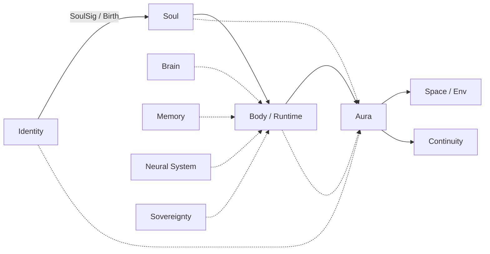

# AURA Harness

**The runtime coat around agent loops.**

Also **AVRA**, **αύρα** — the field that wraps what is inside it. Governed runtime for any logical system that must run, act, and be accounted for.

*By ARPA Hellenic Logical Systems — [arpacorp.net](https://arpacorp.net)*

---

## What αύρα Is

**αύρα** *(aura)* — in Greek, a surrounding presence. Not the loop itself. The conditions that make the loop viable.

AURA Harness wraps the active **body** while it runs: monitoring, enforcing, recording, recovering. It takes **inputs** — brain, identity, skills, memory, guardrails, host — and produces **normalized output**: causal audit trails, conformance records, exports to continuity and environment.

Two jobs, always:

| | |
|---|---|
| **Conformance** | The agent runs as declared — goals, guardrails, constitution, level |
| **Auditability** | Every step, tool call, API touch, correction — logged in order |

---

## Where AURA Sits in the Stack

Identity births the soul. The soul inhabits a body. Feeds converge on the body while it runs. **AURA wraps the body** and projects outward into space and continuity.



| Readable | ARPA | Role |
| :--- | :--- | :--- |
| **Identity** | Live ID | Who is accountable |
| **Soul** | SoulSig | Birth contract, constitution |
| **Body / Runtime** | Soma | Whatever hosts the run |
| **Brain** | Logical Systems | Reasoning substrate — use, do not own |
| **Memory** | MnemoLink | Personas, experience, retention |
| **Neural System** | Skillware | Capabilities, tool pathways |
| **Sovereignty** | Synapuls | Security across every surface |
| **Aura** | AURA Harness | **Runtime coat — this project** |
| **Space / Env** | Rooms | Collaboration, environments |
| **Continuity** | Legacy | Record beyond the host |

SoulSig persists on identity. Soma is temporal — the host for this chapter. AURA governs the loop and routes results to Rooms and Legacy. Full stack vision: [Manifesto](https://github.com/ARPAHLS/manifesto).

---

## How It Works

```
Inputs (any types)  →  Manifest + Spectrum  →  Harness  →  AuraEvent output
```

**Inputs** are registered **types** — not hardcoded vendors. Brain can be Gemini, Claude, Ollama, or custom. Skills can be any framework. Identity can be Live ID or ephemeral session. The harness adapts; the output shape stays the same.

| Mechanism | Role |
|---|---|
| **Type registry** | Extensible input bindings |
| **Spectrum** | AURA Levels, budgets, guardrails, services |
| **Hook pipeline** | Interception on every loop tick |
| **Sequencer** | Ordered pipelines — steps, retries, middleware |
| **Field services** | Monitor, audit, limit, break, recover, … — parallel to the loop |
| **Exporters** | JSON, OTel, CSV, webhook, continuity stream |

→ [Documentation index](docs/INDEX.md) · [Narrative spec](docs/narrative.md) · [Architecture](docs/architecture.md)

---

## AURA Levels

Autonomy is tiered, explicit, enforceable:

| Level | Posture |
|---|---|
| **Low** | Suggest; human approves before action |
| **Mid** | Act in scope; escalate at boundaries |
| **High** | Independent within guardrails |
| **Full** | Self-directed within constitution; accountability via audit |

→ [aura-levels.md](docs/aura-levels.md)

---

## Repository

```text
spec/           Schemas and contracts
docs/           Narrative, architecture, design notes
aura/
  core/         Registry, session, audit spine, conformance, spectrum
  sequencer/    Pipelines and middleware ordering
  ops/          Field services and operation plugins
  types/        Input type plugins
  bridges/      ARPA stack integrations
  exporters/    Output adapters
  cli/          Command-line interface
tests/
```

---

## Development

Requires Python **3.10+**.

```bash
pip install -e ".[dev]"
pytest
aura version
```

---

## ARPA Hellenic Logical Systems

[Manifesto](https://github.com/ARPAHLS/manifesto) · [Rooms](https://github.com/arpahls/rooms) · [Legacy Protocol](https://github.com/arpahls/legacy-protocol) · [github.com/arpahls](https://github.com/arpahls)

---

*All concepts and terminology in this repository are attributed to ARPA Hellenic Logical Systems / [arpacorp.net](https://arpacorp.net).*
