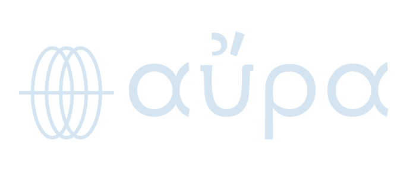
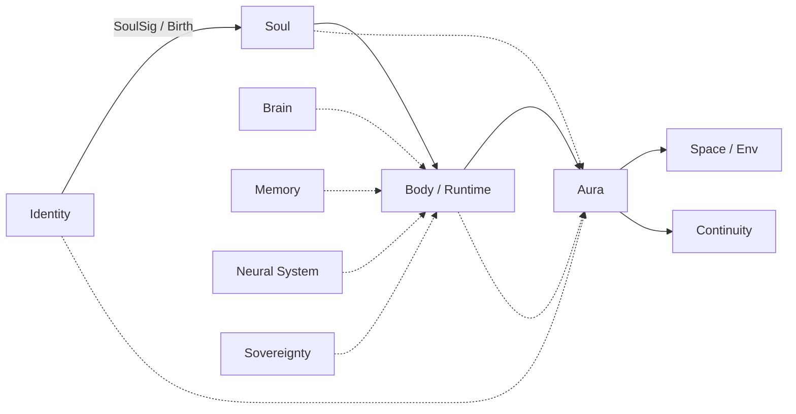

<div align="center">



<br>

**AURA Harness - The runtime coat around agent loops.**

<br>

[](https://github.com/arpahls)
[](https://github.com/ARPAHLS/manifesto)
[](docs/narrative.md)
[](docs/architecture.md)
[](docs/stack-position.md)
[](spec/)

<br>

[Overview](#overview) ·
[Stack](#where-aura-sits-in-the-stack) ·
[How It Works](#how-it-works) ·
[Levels](#aura-levels) ·
[Documentation](#documentation) ·
[Development](#development)

</div>

---

## Overview

**αύρα** *(aura)* — in Greek, a surrounding presence: the field that wraps what is inside it. In ARPA Logical Systems, if an agent loop is an active **body**, aura is not the loop/runtime/body itself, but the conditions that make the loop viable — what we call a **harness**.

**AURA Harness** is that coat for software agents. It wraps whatever **runtime** hosts your loop — a script, an orchestration framework, a device — and works **alongside** it, not instead of it. On every turn it can enforce guardrails and autonomy levels, watch for drift and errors, pause or recover, chain multi-step pipelines with retries, and record a full causal log of what happened and why.

What you plug in is open-ended: models, tools, memory, identity, policy, security layers, and more — registered as extensible **types**, not hardcoded vendors. The harness governs the run itself: whether behavior matched what was declared, every tool call and correction in order, and exports you can send to logs, observability stacks, or webhooks.

| | |
|---|---|
| **Conformance** | The agent runs as declared — goals, guardrails, constitution, level |
| **Auditability** | Every step, tool call, API touch, correction — logged in order |

---

## Where AURA Sits in the Stack

Identity births the soul. The soul inhabits a body. Feeds converge on the body while it runs. **AURA wraps the body** and projects outward into space and continuity.



| Layer | ARPA Stack | Role |
| :--- | :--- | :--- |

| **Brain** | Logical Systems | Reasoning substrate |
| **Identity** | Live ID | Who is accountable |
| **Soul** | SoulSig | Birth contract, constitution |
| **Body / Runtime** | Soma | Whatever hosts the run |
| **Memory** | Mnemonic Matrix | Personas, experience, retention |
| **Neural System** | Skillware | Capabilities, tool pathways |
| **Aura** | AURA | **Runtime coat/harness — this project** |
| **Sovereignty** | Synapuls | Security across every surface |
| **Space / Env** | Rooms | Cross-species collaboration envs |
| **Continuity** | Legacy Protocol | Immutable record beyond the host |

SoulSig persists on identity. Soma is temporal — the host for this chapter. AURA governs the loop and routes results to Rooms and Legacy.

→ Full stack vision: [Manifesto](https://github.com/ARPAHLS/manifesto) · [Stack position](docs/stack-position.md)

---

## How It Works

```
Inputs (any types)  →  Manifest + Spectrum  →  Harness  →  AuraEvent output
```

**Inputs** are registered **types** — not hardcoded vendors. Brain can be Gemini, Claude, Ollama, or custom. Skills can be any framework. Identity can be Live ID or ephemeral session. The harness adapts; the output shape stays the same.

| Mechanism | Role |
|---|---|
| **Type registry** | Extensible input bindings |
| **Spectrum** | AURA Levels, budgets, guardrails, services |
| **Hook pipeline** | Interception on every loop tick |
| **Sequencer** | Ordered pipelines — steps, retries, middleware |
| **Field services** | Monitor, audit, limit, break, recover, … — parallel to the loop |
| **Exporters** | JSON, OTel, CSV, webhook, continuity stream |

---

## AURA Levels

Autonomy is tiered, explicit, enforceable:

| Level | Posture |
|---|---|
| **Low** | Suggest; human approves before action |
| **Mid** | Act in scope; escalate at boundaries |
| **High** | Independent within guardrails |
| **Full** | Self-directed within constitution; accountability via audit |

→ [aura-levels.md](docs/aura-levels.md)

---

## Documentation

| Topic | Links |
| :--- | :--- |
| **Index** | [docs/INDEX.md](docs/INDEX.md) |
| **Narrative** | [docs/narrative.md](docs/narrative.md) |
| **Architecture** | [docs/architecture.md](docs/architecture.md) · [three-rings.md](docs/three-rings.md) |
| **Runtime** | [sequencer.md](docs/sequencer.md) · [field-services.md](docs/field-services.md) · [outputs.md](docs/outputs.md) |
| **Trust & identity** | [trust-paths.md](docs/trust-paths.md) |
| **Specifications** | [spec/](spec/) |

---

## Development

Requires **Python 3.10+**.

```bash
git clone https://github.com/ARPAHLS/aura.git
cd aura
pip install -e ".[dev]"
pytest
aura version
```

---

<div align="center">

<br>
<div align="center">
  
  <br>
  <sub>Developed and Maintained by <b>ARPA HELLENIC LOGICAL SYSTEMS</b></sub>
  <br>
  <sub>Support: systems@arpacorp.net</sub>
</div>
