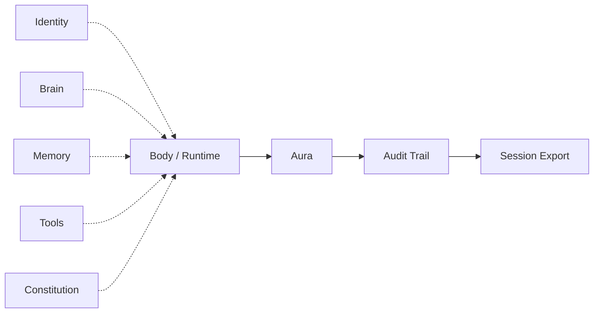

<div align="center">


<br>

**AURA Harness - The runtime coat around agent loops.**

<br>

[](https://github.com/arpahls)
[](https://github.com/ARPAHLS/manifesto)
[](docs/getting-started.md)
[](docs/architecture.md)
[](examples/)
[](spec/)

<br>

[Overview](#overview) ·
[Architecture](#aura-architecture) ·
[How It Works](#how-it-works) ·
[Documentation](#documentation) ·
[Development](#development)

</div>

---

## Overview

**αύρα** *(aura)* — in Greek, a surrounding presence: the field that wraps what is inside it. In ARPA Logical Systems, if an agent loop is an active **body**, aura is not the loop/runtime/body itself, but the conditions that make the loop viable — what we call a **harness**.

**AURA Harness** wraps whatever hosts your loop — a script, a framework, a device — and works **alongside** it, not instead of it. It records a causal audit log, enforces your rules, and exports session summaries you can ship to logs or observability tools.

What you plug in is open-ended: models, tools, memory, identity, policy, and more — via adapters over time, not hardcoded vendors. **v0.1** ships the kernel: agent registry, sessions, constraints, JSONL export, and a Python SDK.

| | |
|---|---|
| **Conformance** | Did the run stay within declared rules? |
| **Auditability** | Every meaningful event logged in order, with causal IDs |

---

## AURA Architecture

This is the **AURA Harness** view — not the full [ARPA manifesto stack](https://github.com/ARPAHLS/manifesto). Soul, Rooms, Legacy, and the birth chain live there. Here, parallel **inputs** feed the **body**; **Aura** wraps it; an **audit trail** records everything; **session export** delivers the log on close.



| Layer | Role in AURA |
| :--- | :--- |
| **Identity** | Agent ID trailer — `AURA-000n`, optional name, your external IDs |
| **Brain** | Model / reasoning (adapter — any provider) |
| **Memory** | Retention, persona (adapter — optional) |
| **Tools** | Skills, MCP, APIs, [Skillware](https://github.com/arpahls/skillware) bundles (adapter) |
| **Constitution** | Rules, guardrails, constraints — what the run must obey |
| **Body / Runtime** | Whatever hosts the loop — script, framework, device |
| **Aura** | **This project** — attach, enforce, record |
| **Audit Trail** | Append-only causal event log during the run |
| **Session Export** | JSONL log + conformance summary when the session closes |

All inputs are optional except a body to wrap. Use any subset; AURA adapts.

→ Deeper detail: [stack-position.md](docs/stack-position.md) · Full ARPA vision: [Manifesto](https://github.com/ARPAHLS/manifesto)

---

## How It Works

**v0.1 flow:**

```
Agent (AURA-000n)  →  Session open  →  emit events  →  enforce rules  →  close  →  JSONL + summary
```

| Component | Status | Role |
| :--- | :--- | :--- |
| **Agent registry** | Shipped | Permanent `AURA-000n` IDs, optional name, user ID trailer |
| **Session** | Shipped | Modes: `script`, `task`, `continuous` |
| **Audit spine** | Shipped | Append-only JSONL with causal event IDs |
| **Constraint engine** | Shipped | Token limits, confirm-before-action, allow/deny tools |
| **Conformance summary** | Shipped | Declared rules vs observed events on close |
| **Python SDK + CLI** | Shipped | `agent()`, `session()`, `emit()`, `approve()`, export |
| **Type adapters** | Roadmap | Brain, skills, memory plugins — see [ROADMAP](docs/ROADMAP.md) |
| **Sequencer / field services** | Roadmap | Pipelines and observer presets — deferred |

Lite identity: AURA assigns `AURA-0001`, `AURA-0002`, … if you provide no name. Your own IDs nest under `ids` — no identity service required.

→ [concepts.md](docs/concepts.md) · [getting-started.md](docs/getting-started.md) · [examples/](examples/)

---

## Documentation

| Topic | Links |
| :--- | :--- |
| **Start here** | [getting-started.md](docs/getting-started.md) · [concepts.md](docs/concepts.md) · [examples/](examples/) |
| **Index** | [docs/INDEX.md](docs/INDEX.md) |
| **Architecture** | [architecture.md](docs/architecture.md) · [stack-position.md](docs/stack-position.md) |
| **Identity** | [trust-paths.md](docs/trust-paths.md) — lite ID trailer, no Live ID required |
| **Roadmap** | [ROADMAP.md](docs/ROADMAP.md) |
| **Specifications** | [spec/](spec/) — schemas for adapters and events |
| **Vision (long-form)** | [narrative.md](docs/narrative.md) |

---

## Development

Requires **Python 3.10+**.

```bash
git clone https://github.com/ARPAHLS/aura.git
cd aura
pip install -e ".[dev]"
pytest
aura version
```

Quick start:

```python
from aura import agent, configure

configure()
with agent("my-bot").session() as run:
    run.emit("turn.start", {"input": "hello"})
    run.emit("turn.end", {"tokens": 10})
print(run.exports)
```

→ [getting-started.md](docs/getting-started.md) · [examples/](examples/) · [CHANGELOG.md](CHANGELOG.md) · [CONTRIBUTING.md](CONTRIBUTING.md)

---

<div align="center">

<br>
<div align="center">
  
  <br>
  <sub>Developed and Maintained by <b>ARPA HELLENIC LOGICAL SYSTEMS</b></sub>
  <br>
  <sub>Support: systems@arpacorp.net</sub>
</div>
