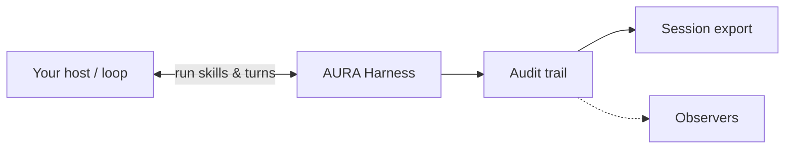
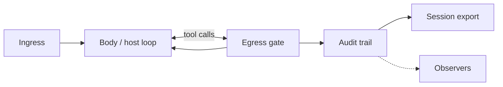

<div align="center">


<br>

**A runtime coat for agent loops — audit, policy, and compliance export.**

<br>

[](LICENSE)
[](https://www.python.org/downloads/)
[](docs/INDEX.md)

<br>

[Overview](#overview) ·
[How it works](#how-it-works) ·
[Architecture](#architecture) ·
[Quick start](#quick-start) ·
[Documentation](#documentation)

</div>

---

## Overview

**AURA Harness** wraps whatever runs your agent loop — a Python script, [Skillware](https://github.com/arpahls/skillware), LangGraph, or your own host. It does not replace the loop. It sits around it, records what happened, enforces your rules at tool boundaries, and exports a session you can ship to logs or compliance.

Think of it as a **sidecar**: your body runs; AURA attaches, gates risky actions, and leaves a causal audit trail.

| | |
|---|---|
| **For** | Teams that need provenance, policy, and repeatable pipelines around agents |
| **Not** | A model runtime, orchestrator, or skill framework |
| **Pairs with** | Skillware (tools), any LLM host, your existing loop |

---

## How it works



1. Open a **session** for an agent (stable `agent_ref` + internal id).
2. Your **host** runs — model loop, Skillware `execute()`, or a declared **sequencer** pipeline.
3. AURA **egress** checks policy before tools fire; every step is logged.
4. On close you get **JSONL + audit report + conformance summary** (and optional OTel export).

→ Details: [using-aura.md](docs/using-aura.md) · [skillware-integration.md](docs/skillware-integration.md)

---

## Architecture

AURA is the **harness** (ingress, policy, egress, record). It is not the body and not the same thing as egress — egress is the gate on the way out to tools, then control returns to the body.



Optional inputs (identity, brain, memory, tools, constitution) feed the body — see [stack-position.md](docs/stack-position.md).

---

## Quick start

Requires **Python 3.10+**.

```bash
git clone https://github.com/ARPAHLS/aura.git
cd aura
py -3.13 -m venv .venv && .venv\Scripts\activate   # Windows
pip install -e ".[dev]"
pytest
```

```python
from aura import agent, configure

configure()

ag = agent("acme/research-bot", policy_version="1")
with ag.session() as run:
    run.emit("turn.start", {"input": "screen this wallet"})
    run.emit("turn.end", {"tokens": 120})

print(run.exports)  # jsonl, summary, audit_report, otel paths
```

CLI: `aura agent create`, `aura run`, `aura export`, `aura compare`, `aura export-otel`.

→ [getting-started.md](docs/getting-started.md) · [examples/](examples/)

---

## Documentation

| Topic | Links |
| :--- | :--- |
| **Start** | [getting-started.md](docs/getting-started.md) · [concepts.md](docs/concepts.md) · [using-aura.md](docs/using-aura.md) |
| **Integration** | [skillware-integration.md](docs/skillware-integration.md) · [sequencer.md](docs/sequencer.md) |
| **Identity & audit** | [trust-paths.md](docs/trust-paths.md) · [outputs.md](docs/outputs.md) |
| **Compare & position** | [comparison.md](docs/comparison.md) · [ROADMAP.md](docs/ROADMAP.md) |
| **Contribute** | [CONTRIBUTING.md](CONTRIBUTING.md) · [TESTING.md](docs/TESTING.md) · [CHANGELOG.md](CHANGELOG.md) |

---

<div align="center">

<br>

<br>
<sub>Developed and Maintained by <b>ARPA HELLENIC LOGICAL SYSTEMS</b></sub>
<br>
<sub>Support: systems@arpacorp.net</sub>

</div>
