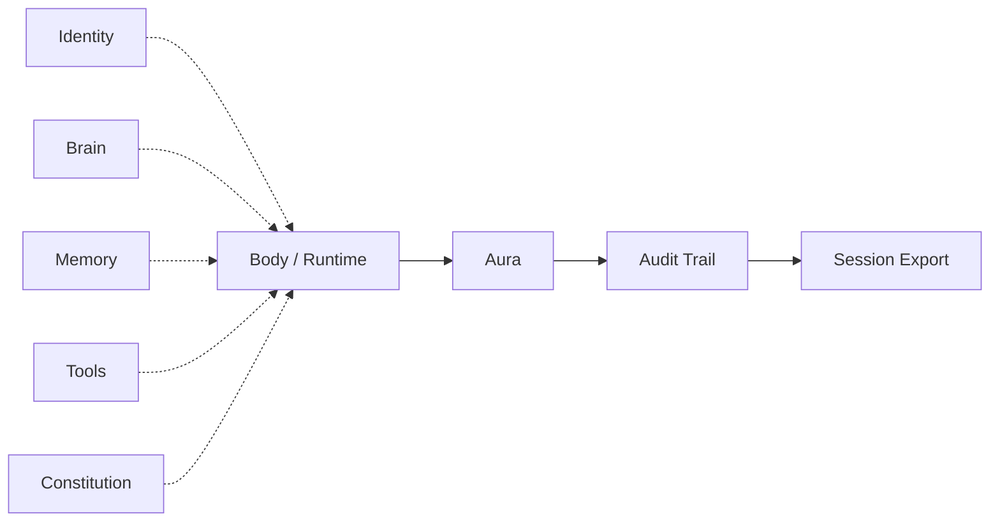

# Architecture (v0.1)

AURA wraps any agent loop in six steps:

```
ATTACH → PROBE → HOOK → ENFORCE → RECORD → EXPORT
```

## Data flow



→ Layer definitions: [stack-position.md](stack-position.md) · Positioning: [comparison.md](comparison.md)

## Core (shipped in v0.1)

| Module | Role |
|---|---|
| `aura/agents/` | Registry, `AURA-000n`, ID trailer |
| `aura/config.py` | Global + project paths |
| `aura/core/session.py` | Session modes, open/close |
| `aura/core/spine.py` | Audit trail (append-only JSONL) |
| `aura/core/constraints.py` | Modular rules |
| `aura/core/conformance.py` | Declared vs observed summary |
| `aura/api.py` | Public SDK |
| `aura/runtime/python.py` | Python attach helper |
| `aura/exporters/jsonl.py` | Session export |

## Extension surface (roadmap)

| Module | Role |
|---|---|
| `aura/core/registry.py` | Type plugins (brain, skills, memory) |
| `aura/sequencer/` | Multi-step pipelines (deferred) |
| `aura/ops/` | Observer presets (deferred) |
| `aura/bridges/` | Optional ARPA stack exporters |

**Principle:** new capabilities emit or subscribe to the spine — core loop unchanged.

## Hook stages (full pipeline — partial in v0.1)

v0.1 uses `emit(kind, payload)` freely. Planned ordered hooks:

`pre_turn` → `pre_tool` → `post_tool` → `turn_end` → `post_session`

See [pipeline.py](../aura/core/pipeline.py) for enum definitions.

## ARPA stack (optional)

AURA works standalone. In the wider ARPA stack, aura sits around Soma and may export to Rooms or Legacy — via adapters, never required.

→ [stack-position.md](stack-position.md) · [Manifesto](https://github.com/ARPAHLS/manifesto)
