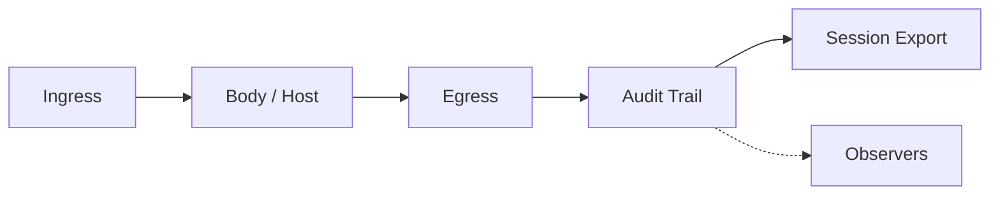

# Architecture (v0.2)

AURA wraps any agent loop:

```
ATTACH → INGRESS → [ BODY ] → EGRESS → RECORD → EXPORT
                      ↑
                 Observers (parallel)
```

## Membrane flow



Parallel inputs (Identity, Brain, Memory, Tools, Constitution) feed the body — see [stack-position.md](stack-position.md).

→ Positioning: [comparison.md](comparison.md) · Usage: [using-aura.md](using-aura.md)

## Core (v0.1 kernel)

| Module | Role |
|---|---|
| `aura/agents/` | Registry, `AURA-000n`, ID trailer |
| `aura/config.py` | Global + project paths |
| `aura/core/session.py` | Session modes, open/close, observers |
| `aura/core/spine.py` | Audit trail (append-only JSONL) |
| `aura/core/constraints.py` | Modular rules |
| `aura/core/conformance.py` | Rules + sequencer order on close |
| `aura/api.py` | Public SDK |
| `aura/runtime/python.py` | Python attach helper |
| `aura/exporters/jsonl.py` | Session export |

## v0.2 additions

| Module | Role |
|---|---|
| `aura/membrane/` | Ingress context, egress `guarded_tool_call` |
| `aura/sequencer/` | Declarative step runner (`skill`, `op`, `gate`, …) |
| `aura/hosts/` | Skillware host + mock skills for tests |
| `aura/observers/` | Parallel audit subscribers |

## Extension surface (roadmap)

| Module | Role |
|---|---|
| `aura/core/registry.py` | Type plugins (brain, skills, memory) |
| `aura/ops/` | Named observer presets |
| `aura/bridges/` | Optional ARPA stack exporters |

**Principle:** new capabilities emit or subscribe to the spine — core loop unchanged.

## Sequencer vs hook pipeline

- **Sequencer** — prescriptive multi-step runs with per-step `step_id` on spine (shipped v0.2)
- **Hook pipeline** — intercept loop ticks (`pre_turn`, `pre_tool`, …) — partial; use `emit()` today

See [sequencer.md](sequencer.md) and [pipeline.py](../aura/core/pipeline.py) for hook enum definitions.

## ARPA stack (optional)

AURA works standalone. In the wider ARPA stack, aura sits around Soma and may export to Rooms or Legacy — via adapters, never required.

→ [stack-position.md](stack-position.md) · [Manifesto](https://github.com/ARPAHLS/manifesto)
