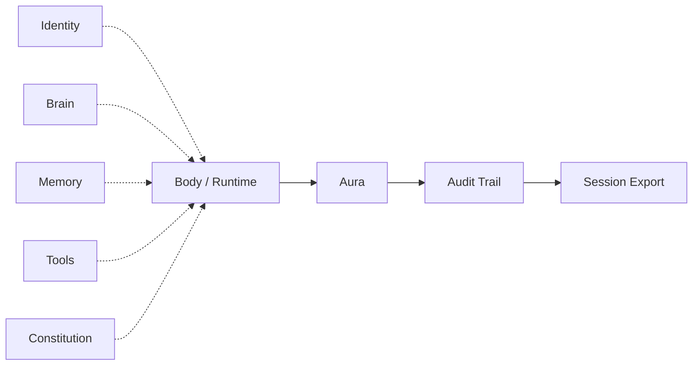

# AURA Architecture

How **AURA Harness** models a run — distinct from the full [ARPA manifesto stack](https://github.com/ARPAHLS/manifesto).

The manifesto diagram covers Identity → Soul → Body → Aura → Rooms / Legacy. **This repo uses a harness-centric view:** parallel inputs, one body, one coat, one audit trail out.

---

## Flow

---

## Layers

| Layer | What it is | v0.1 |
| :--- | :--- | :--- |
| **Identity** | `AURA-000n`, optional name, `ids.external` trailer | Shipped — agent registry |
| **Brain** | Any model or reasoning substrate | Adapter (roadmap) |
| **Memory** | Any retention backend | Adapter (roadmap) |
| **Tools** | Skills, MCP, HTTP APIs, Skillware | Adapter (roadmap) |
| **Constitution** | Rules, guardrails, constraints on the agent profile | Shipped — constraint engine |
| **Body / Runtime** | The active loop — Python script first | Shipped — runtime helper |
| **Aura** | Harness — hook, enforce, record | Shipped — session + SDK |
| **Audit Trail** | Append-only causal log (`AuraEvent` stream) | Shipped — audit spine / JSONL |
| **Session Export** | Deliverable on close — `.jsonl` + `.summary.json` | Shipped |

---

## How to read this

**Inputs** (dotted) — none are required except something acting as a body. Bring any combination; adapters normalize over time.

**Body / Runtime** — the loop AURA wraps. Not owned by AURA.

**Aura** — runs alongside the body: checks constitution, appends to audit trail, never replaces the loop.

**Audit Trail** — official name for the live record. Code: `AuditSpine`. Every event has causal IDs.

**Session Export** — official name for the closed-session output. Feeds logs, SIEM, observability, or future bridges (Legacy, webhooks).

---

## vs ARPA manifesto stack

| Manifesto | AURA Harness |
| :--- | :--- |
| Identity → Soul → Body chain | Identity is an input alongside brain, memory, tools |
| Soul / SoulSig | Folded into **Constitution** + optional `ids` metadata |
| Neural System | **Tools** |
| Aura → Rooms / Legacy | Aura → Audit Trail → Export (bridges to Rooms/Legacy later) |
| Sovereignty | Security rules in **Constitution** or future adapter |

→ [README.md](../README.md) · [architecture.md](architecture.md) · [Manifesto](https://github.com/ARPAHLS/manifesto)

---

## Principles

| | |
|---|---|
| Any subset of inputs | AURA stretches to what you bring |
| Wrap, don't replace | Body keeps the loop |
| Events before features | Audit trail is the foundation |
| Constitution is declarative | Rules compared on close (conformance) |
