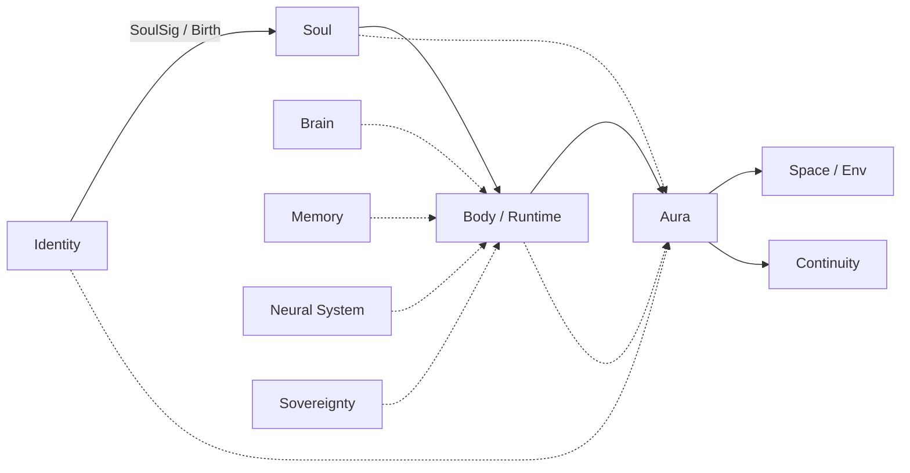

# Stack Position

Where **AURA Harness** sits in the ARPA logical-system stack.

---

## Flow

---

## How to Read This

**Identity → Soul → Body** — birth chain. Who is accountable, what was contracted, where the run lives.

**Feeds into Body** (dotted) — brain, memory, neural system, sovereignty converge on the active host while it runs. They are inputs, not owned by AURA.

**Body → Aura** — the coat wraps the running form. Governance, audit, and enforcement happen here.

**Aura → Space / Continuity** — governed output projects into collaboration (Rooms) and persistence (Legacy). Nothing bypasses the coat.

**Identity, Soul, Body → Aura** (dotted) — constitution, UBH context, and host metadata bind into the harness for the duration of the run.

---

## ARPA Names

| Readable | ARPA | Relationship to AURA |
| :--- | :--- | :--- |
| **Identity** | Live ID | Input type — accountability, UBH |
| **Soul** | SoulSig | Birth manifest → harness configuration |
| **Body / Runtime** | Soma | Host; a script counts |
| **Brain** | Logical Systems | Input type — swappable reasoning |
| **Memory** | MnemoLink | Input type — retention, persona |
| **Neural System** | Skillware | Input type — capabilities, tools |
| **Sovereignty** | Synapuls | Input type — surface security |
| **Aura** | AURA Harness | **This project** |
| **Space / Env** | Rooms | Output bridge — environments |
| **Continuity** | Legacy | Output bridge — persistence |

---

## Principles

| | |
|---|---|
| Active harness ⇒ active body | Autonomy without a host is unbounded |
| Brains are rented | AURA integrates any logical system; it does not compete on models |
| Guardrails from anywhere | SoulSig, manifest, memory layer, skill constitution — AURA enforces all |
| Same harness, many inputs | Types are plugins; the core does not hardcode vendors |

---

See [narrative.md](narrative.md) · [README.md](../README.md) · [Manifesto](https://github.com/ARPAHLS/manifesto)
